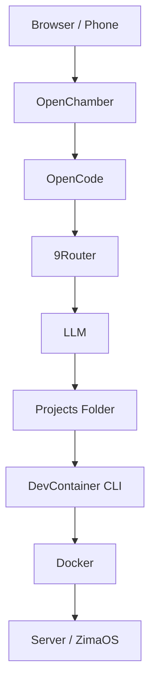
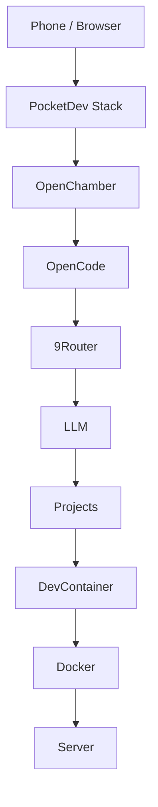

# PocketDev

## Portable AI Development Environment in Containers

## 1. Vision

PocketDev là một môi trường phát triển phần mềm chạy hoàn toàn trong container, cho phép bạn code, build và chạy project từ bất kỳ thiết bị nào, kể cả điện thoại, mà không cần cài đặt toolchain trên máy cá nhân.

Ý tưởng cốt lõi của PocketDev rất đơn giản:

> Development environment không nằm trên laptop, mà nằm trên server.
> Bạn chỉ cần mở trình duyệt hoặc điện thoại để làm việc.

PocketDev không phải là một IDE mới, cũng không phải một AI platform mới.
PocketDev chỉ đơn giản là **một container stack để chạy AI coding environment**.

---

# 2. Purpose of This Repository

Repository này tồn tại để giải quyết một vấn đề thực tế:

Nhiều open-source project như:

* OpenCode
* OpenChamber
* 9Router
* DevContainer CLI

không cung cấp Docker image chính thức hoặc image không phù hợp với môi trường container-only như ZimaOS.

Repository này sẽ:

* Build Docker images từ source
* Publish images lên GHCR
* Cung cấp docker-compose stack
* Cho phép chạy toàn bộ AI coding environment bằng một lệnh docker compose

Repository này **không phát triển OpenCode, OpenChamber hay 9Router**, mà chỉ cung cấp container runtime environment cho chúng.

---

# 3. What PocketDev Provides

PocketDev cung cấp các Docker images sau:

| Image                  | Purpose                                |
| ---------------------- | -------------------------------------- |
| pocketdev-opencode     | AI coding agent runtime                |
| pocketdev-openchamber  | Web UI                                 |
| pocketdev-9router      | LLM router (OpenAI compatible gateway) |
| pocketdev-devcontainer | DevContainer CLI runner                |
| pocketdev-base         | Base runtime environment (optional)    |

Tất cả images sẽ được publish lên GHCR để có thể pull trực tiếp.

---

# 4. Runtime Architecture

Kiến trúc runtime của PocketDev:



## Kiến trúc Runtime Chi Tiết

Dưới đây là bảng chi tiết các thành phần trong kiến trúc runtime của PocketDev:

| Thành Phần | Mô Tả | Chức Năng Chính | Dependencies | Ghi Chú |
|-------------|--------|------------------|--------------|---------|
| **Browser / Phone** | Giao diện người dùng cuối | Truy cập PocketDev từ bất kỳ thiết bị nào | Không có | Điểm khởi đầu của workflow |
| **OpenChamber** | Giao diện web chính | Cung cấp UI để tương tác với AI coding environment, quản lý projects và workflows | Browser/Phone | Frontend portal cho toàn bộ hệ thống |
| **OpenCode** | AI agent viết code | Tự động tạo, chỉnh sửa và quản lý code dựa trên prompts từ người dùng | OpenChamber, 9Router | Core AI component cho code generation |
| **9Router** | LLM router | Điều hướng và quản lý các yêu cầu đến LLM models, tương thích OpenAI API | OpenCode, LLM | Gateway cho AI services |
| **LLM** | Large Language Model | Cung cấp khả năng AI để xử lý ngôn ngữ tự nhiên và code generation | 9Router | External AI service (OpenAI, etc.) |
| **Projects Folder** | Thư mục lưu trữ code | Chứa tất cả source code của các projects được tạo bởi AI | OpenCode, DevContainer | Persistent storage cho code |
| **DevContainer CLI** | Công cụ chạy container | Khởi tạo và quản lý development containers cho từng project | Projects Folder, Docker | Tự động setup toolchain |
| **Docker** | Container runtime | Chạy tất cả các services trong isolated containers | DevContainer CLI | Core containerization platform |
| **Server / ZimaOS** | Host environment | Máy chủ vật lý hoặc ZimaOS chạy toàn bộ stack | Docker | Infrastructure layer |

Host không cần cài:

* Node
* .NET
* Python
* Go
* Rust
* Bun
* pnpm
* build tools

Tất cả toolchain chạy trong DevContainer.

---

# 5. Workflow

Workflow dự kiến khi sử dụng PocketDev:

```text
1. User mở OpenChamber từ trình duyệt hoặc điện thoại
2. User prompt AI tạo project
3. OpenCode tạo hoặc clone repository vào /projects
4. Nếu repository có .devcontainer/devcontainer.json
       → devcontainer up
5. DevContainer container start
6. dotnet run / npm run dev chạy trong container
7. Port được forward ra ngoài
8. User truy cập ứng dụng qua browser
```

Toàn bộ quá trình không cần laptop có toolchain.

---

# 6. Docker Compose Goal

PocketDev được thiết kế để chạy bằng một docker compose duy nhất:

```bash
docker compose up -d
```

Sau khi chạy compose:

* OpenChamber UI hoạt động
* OpenCode agent hoạt động
* 9Router hoạt động
* DevContainer runner sẵn sàng
* Projects volume mount sẵn

Hệ thống sẵn sàng để AI tạo project và chạy project.

---

# 7. Repository Structure (Proposed)

Cấu trúc repository đề xuất:

```text
pocketdev/
│
├── images/
│   ├── opencode/
│   ├── openchamber/
│   ├── 9router/
│   └── devcontainer/
│
├── compose/
│   └── docker-compose.yml
│
├── configs/
│   └── opencode.json
│
└── .github/workflows/
    └── build-images.yml
```

Repository sẽ build images và push lên GHCR.

---

# 8. GHCR Images

Images sẽ được publish theo naming convention:

```text
ghcr.io/<owner>/pocketdev-opencode
ghcr.io/<owner>/pocketdev-openchamber
ghcr.io/<owner>/pocketdev-9router
ghcr.io/<owner>/pocketdev-devcontainer
```

Docker compose sẽ pull trực tiếp từ GHCR.

---

# 9. Design Philosophy

PocketDev dựa trên các nguyên tắc sau:

1. Development environment phải containerized
2. Host không cần toolchain
3. Projects chạy trong DevContainer
4. AI agent có thể tạo và chạy project
5. Tất cả phải chạy bằng docker compose
6. Images phải build sẵn và publish lên GHCR
7. Hệ thống phải chạy được trên ZimaOS / homelab
8. Development environment phải reproducible
9. Có thể code từ bất kỳ thiết bị nào
10. Development environment phải “portable”

---

# 10. One Sentence Summary

PocketDev có thể được mô tả bằng một câu:

> PocketDev is a container-based AI development environment that allows you to code, build and run projects from anywhere, even from your phone, without installing any toolchain on your local machine.

---

# 11. Final Concept

PocketDev không phải IDE, không phải platform, không phải framework.
PocketDev chỉ đơn giản là:

> Một development environment nằm trên server để bạn có thể code ở bất cứ đâu.